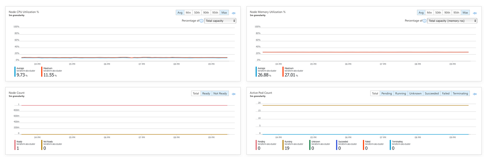
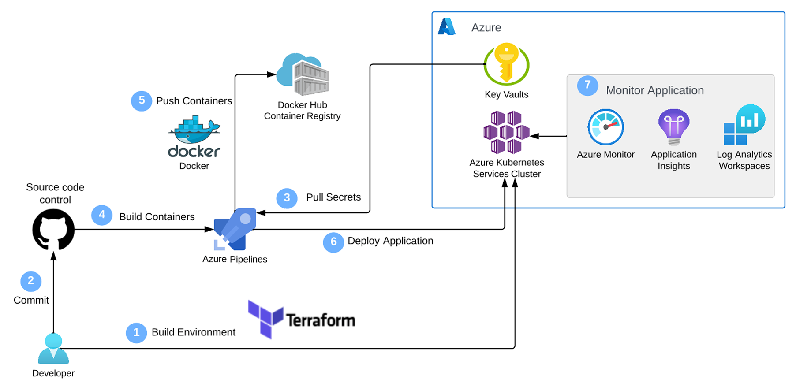

# Web-App-DevOps-Project

Welcome to the Web App DevOps Project repo! This application allows you to efficiently manage and track orders for a potential business. It provides an intuitive user interface for viewing existing orders and adding new ones.

## Table of Contents

- [Features](#features)
- [Web Application Build and Containerisation](https://github.com/Naymul24/Web-App-DevOps-Project/blob/main/README.md#web-application-build-and-containerisation)
   - [Additional Features](https://github.com/Naymul24/Web-App-DevOps-Project/blob/main/README.md#additional-features)
   - [Containerisation with Docker](https://github.com/Naymul24/Web-App-DevOps-Project/blob/main/README.md#containerisation-with-docker)
- [Deploying Containerised Application onto a Kubernetes Cluster](https://github.com/Naymul24/Web-App-DevOps-Project/blob/main/README.md#deploying-containerised-application-onto-a-kubernetes-cluster)
   - [Defining Network Services with IaC](https://github.com/Naymul24/Web-App-DevOps-Project/blob/main/README.md#defining-network-services-with-iac)
   - [Defining an AKS Cluster with IaC](https://github.com/Naymul24/Web-App-DevOps-Project/blob/main/README.md#defining-an-aks-cluster-with-iac)
   - [Creating an AKS Cluster with IaC](https://github.com/Naymul24/Web-App-DevOps-Project/blob/main/README.md#creating-an-aks-cluster-with-iac)
   - [Kubernetes Deployment to AKS](https://github.com/Naymul24/Web-App-DevOps-Project/blob/main/README.md#kubernetes-deployment-to-aks)
- [Configuration of CI/CD Pipeline](https://github.com/Naymul24/Web-App-DevOps-Project/blob/main/README.md#configuration-of-cicd-pipeline)
   - [CI/CD Pipeline with Azure DevOps](https://github.com/Naymul24/Web-App-DevOps-Project/blob/main/README.md#cicd-pipeline-with-azure-devops)
   - [AKS Cluster Monitoring](https://github.com/Naymul24/Web-App-DevOps-Project/blob/main/README.md#aks-cluster-monitoring)
   - [AKS Integration with Azure Key Vault for Secrets Management](https://github.com/Naymul24/Web-App-DevOps-Project/blob/main/README.md#aks-integration-with-azure-key-vault-for-secrets-management)
- [Technology Stack](#technology-stack)
- [Contributors](#contributors)
- [License](#license)

## Features

- **Order List:** View a comprehensive list of orders including details like date UUID, user ID, card number, store code, product code, product quantity, order date, and shipping date.
  

- **Pagination:** Easily navigate through multiple pages of orders using the built-in pagination feature.
  

- **Add New Order:** Fill out a user-friendly form to add new orders to the system with necessary information.
  

- **Data Validation:** Ensure data accuracy and completeness with required fields, date restrictions, and card number validation.

## Web Application Build and Containerisation

### Additional Features

**Delivery Date: Adding Delivery Date Information Column**

The initial implementation involved the addition of delivery columns to enhance specific functionalities in the application. However, the feature was reverted due to its non-essential nature. Below is a detailed guide on how the feature worked and its potential utilisation.

The app.py was modified alongside the orders.html file to incorporate a new feature – the addition of a delivery date information column to the application. The changes were made to enhance the functionality of the application and provide users with valuable information about delivery timelines. Now the company can also monitor the dates the deliveries have been made and ensure fulfilment.

*Developers' Guide:*
- Adding the Delivery Column
1. Create a new feature branch to implement the additional coding. This branch isolates the code changes required to the include the delivery date column. Ensure all following steps are tracked via git
2. The app.py file was modified. Update the app.py file with the following code as seen in this file [CodeChanges] (https://github.com/Naymul24/Web-App-DevOps-Project/blob/main/code_changes.txt)
3. The orders.html file was modified to add the additional column to the user web page. Update the orders.html file with the following code as seen in this file [CodeChanges] (https://github.com/Naymul24/Web-App-DevOps-Project/blob/main/code_changes.txt)

- Removing Delivery Columns
1. The feature was then not necessary so was removed by utilising the tracked code by git. Create a new feature branch to remove the additional coding.
2. Find the commit hash of the specific change to revert. 
3. Revert back to that state using the git revert command

While the feature was reverted due to specific considerations, the documentation should stress the potential for future use and the importance of understanding the feature for ongoing development or enhancements.

### Containerisation with Docker

This involved containerizing the application using Docker. This process facilitates seamless deployment and scalability by encapsulating the application and its dependencies into isolated containers.

**Containerisation Process:**
- **Dockerfile Creation:**
1. Dockerfile was created containing all the commands the user requires to call on the command line to assemble an image including for pulling necessary base images, setting up the working directory, and installing dependencies.
- **Docker Build:**
2. The application was packaged into the Docker image by copying relevant files and directories.
- **Send to the Hub:**
3. The image was tagged and pushed to the hub to be opened by the user.

## Deploying Containerised Application onto a Kubernetes Cluster 

To deploy the application onto a Kubernetes cluster, we have decided to implement Infrastructure as Code using Terraform. The main reasons for deployment to Kubernetes included the ability for application scalability as well as it providing a unified solution for automating the deployment, scaling, and management of the containerised application. It ensures that our application can effortlessly scale in response to varying workloads, enhancing both performance and user experience.

To do this, the infrastruture setup had to be set, which ensured the Kubernetes cluster's seamless operation and secure communication. The following steps were taken:

### Defining Network Services with IaC
1. The Terraform project and modules were created to organise infrastructure code.
2. The initial set of Terraform files for networking services were developed including the main.tf, variable.tf and output.tf files inside the netwworking module directory.
3. First the 3 input variables were defined in the variable.tf files. These included the resource group name, location and a virtual network address space.
   - A resource_group_name variable that will represent the name of the Azure Resource Group where the networking resources will be deployed in.
   - A location variable that specifies the Azure region where the networking resources will be deployed to.
   - A vnet_address_space variable that specifies the address space for the Virtual Network (VNet) that you will create later in the main configuration file of this module.
4. Then in the main.tf file the essential networking resources for an AKS cluster were defined including an Azure Resource Group, a VNet, two subnets and a Network Security Group.
5. Lastly the output.tf files were created including the networking resources for the AKS cluster
   - A vnet_id variable that will store the ID of the previously created VNet.
   - A control_plane_subnet_id variable that will hold the ID of the control plane subnet within the VNet. 
   - A worker_node_subnet_id variable that will store the ID of the worker node subnet within the VNet. 
   - A networking_resource_group_name variable that will provide the name of the Azure Resource Group where the networking resources were provisioned in. 
   - A aks_nsg_id variable that will store the ID of the Network Security Group (NSG). 
6. The networking module was intialised.

### Defining an AKS Cluster with IaC
1. The Terraform files for the aks cluster were developed including the main.tf, variable.tf and output.tf files inside the aks-cluster module directory.
2. Firstly, 6 input variables were defined in the variable.tf files. These included the aks cluster name, cluster location, DNS prefix, the Kubernetes version, the client id and the client secret. Additionally, the output variables from the networking module were defined as the input varibales for the cluster.
   - A aks_cluster_name variable that represents the name of the AKS cluster you wish to create
   - A cluster_location variable that specifies the Azure region where the AKS cluster will be deployed to
   - A dns_prefix variable that defines the DNS prefix of cluster
   - A kubernetes_version variable that specifies which Kubernetes version the cluster will use
   - A service_principal_client_id variable that provides the Client ID for the service principal associated with the cluster
   - A service_principal_secret variable that supplies the Client Secret for the service principal
3. Then in the main.tf file the necessary Azure resources were defined for provisioning an AKS cluster.
4. Lastly the output.tf files were created including the cluster name, cluster id and kubernetes configuration file.
   - A aks_cluster_name variable that will store the name of the provisioned cluster
   - A aks_cluster_id variable that will store the ID of the cluster
   - A aks_kubeconfig variable that will capture the Kubernetes configuration file of the cluster. This file is essential for interacting with and managing the AKS cluster using kubectl.
5. The aks cluster module was then intialised.

### Creating an AKS Cluster with IaC
1. A main.tf file was made in the root terraform directory. Within this file the Azure provider block was provided to enable authentication to Azure using your service principal credentials.
2. In the variable.tf file, the client_id and client_secret arguments were defined.
3. The networking module was then integrated into the project's main configuration. This integration will ensure that the networking resources previously defined in their respective module are included, and therefore accessible in the main project.
4. The cluster module was also integrated into the project's main configuration. This step connects the AKS cluster specifications to the main project, as well as allowing you to provision the cluster within the previously defined networking infrastructure. 
5. The main Terraform project was initialised by using the following command: 'terraform init'. Once initialised it was time to apply the configurations. Before doing so the command 'terraform plan' was used to view the process before commiting. Finally once set the command terraform apply was used This will initiate the creation of the defined infrastructure, including the networking resources and AKS cluster.
6. A .gitignore file was created to add the resultant state file to avoid exposing any secrets.

### Kubernetes Deployment to AKS
Rolling Deployment strategy was chosen to be used. This strategy ensures zero-downtime updates by gradually replacing instances of the previous version with the new one. Kubernetes automatically manages the transition, minimizing disruptions and ensuring a smooth user experience. Now that the infrastructure is in place, the containerised application can be deployed onto Kubernetes by following these instructions:
1. A Kubernetes manifest file was created, named application-manifest.yaml. Inside this file the necessary Deployment resource was defined, which will help deploy the containerised web application onto the Terraform-provisioned AKS cluster. The manifest should include the following:
   - Define a Deployment named flask-app-deployment that acts as a central reference for managing the containerised application.
   - Specify that the application should concurrently run on two replicas within the AKS cluster, allowing for scalability and high availability.
   - Within the selector field, use the matchLabels section to define a label that uniquely identifies your application. For example, you could use the label app: flask-app. This label will allow Kubernetes to identify which pods the Deployment should manage.
   - In the metadata section, define labels for the pod template. Reiterate the use of the label app: flask-app. This label is used to mark the pods created by the Deployment, establishing a clear connection between the pods and the application being managed.
   - Configure the manifest to point to the specific container housing the application, which should be already hosted on Docker Hub. This ensures that the correct container image is utilized for deployment.
   - Expose port 5000 for communication within the AKS cluster. This port servers as the gateway for accessing the application's user interface, as defined in the application code
   - Implement the Rolling Updates deployment strategy, facilitating seamless application updates. Ensure that, during updates, a maximum of one pod deploys while one pod becomes temporarily unavailable, maintaining application availability.   
2. A Kubernetes Service manifest was added to the existing application-manifest.yaml to facilitate internal communication within the AKS cluster. This manifest should achieve the following key objectives:
   - Define a service named flask-app-service to act as a reference for routing internal communication
   - Ensure that the selector matches the labels (app: flask-app) of the previously defined pods in the Deployment manifest. This alignment guarantees that the traffic is efficiently directed to the appropriate pods, maintaining seamless internal communication within the AKS cluster.
   - Configure the service to use TCP protocol on port 80 for internal communication within the cluster. The targetPort should be set to 5000, which corresponds to the port exposed by your container.
   - Set the service type to ClusterIP, designating it as an internal service within the AKS cluster
3. Deploying the Kubernetes manifest. 
   - The following command was used to deploy the manifest 'kubectl apply -f nginx-deployment-v1.yaml'
   - Check the status of the deployment and pods to ensure the initial version is running. To do this use the follwing commands: 'kubectl get deployment' and 'kubectl get pods'. 
4. Validating Deployments on AKS by port forwarding
   - After confirming the health of pods and services, the following command was used to initiate port forwarding for the specific pod: 'kubectl port-forward <pod-name> 5000:5000'. With port forwarding established, the web application hosted on the AKS cluster becomes accessible locally at http://127.0.0.1:5000.
   - The functionality of the web application was thoroughly tested to ensure the app was working. 

## Configuration of CI/CD Pipeline
Our CI/CD pipeline automates the deployment of the application, ensuring an efficient and reliable development workflow. The process encompasses containerisation, Docker image creation, release to Docker Hub, and deployment to the Kubernetes cluster on AKS. Below are the key steps involved in configuring and using the CI/CD pipeline with Azure DevOps.

### CI/CD Pipeline with Azure DevOps

Azure DevOps was used to automate the deployment of the application. The pipeline both automates the containerisation and deployment process, such that every time a new feature is added to the application, it will trigger the automatic build of an updated Docker Image, its release to Docker hub, and the deployment of the updated containers to the Kubernetes cluster. The following steps were taken for the CI/CD pipeline build:
1. A new Azure DevOps project was created, serving as the foundation for our pipeline setup. This was done by logging into Azure DevOps with the associated email account.
2. For efficient version control, GitHub was setup to be the source repository, where our application code resides. Using the Starter Pipeline template, the pipeline setup was initated, laying the groundwork for subsequent customisation.
3. To seamlessly integrate our CI/CD pipeline with Docker Hub, a service connection was established. This involved creating a personal access token on Docker Hub, configuring an Azure DevOps service connection, and verifying its successful setup.
4. The pipeline was configured to build and push the Docker image to Docker Hub automatically upon main branch pushes. A Docker task with the 'buildandPush' command facilitated this process. The CI/CD pipeline executed successfully, allowing local testing of the newly created Docker image.
5. Ensuring secure linkage between the CI/CD pipeline and the AKS cluster, AKS service connection was created and configured in Azure DevOps. This connection was pivotal for effective deployments and management.
6. The CI/CD pipeline configuration was modified to include the Deploy to Kubernetes task, leveraging the deployment manifest in the application repository. The ASK connection established earlier facilitated the automatic deployment of the application to the AKS cluster.
7. The functionality of the CI/CD pipeline was rigorously tested and validated. Pod status within the cluster was monitored to confirm correct creation. To secure access to the application running on AKS, port forwarding via 'kubectl' was initiated. Testing ensued, ensuring the application operated seamlessly, validating the effectiveness of the CI/CD pipeline.

Our CI/CD pipeline is a robust and automated solution that enhances the development and deployment workflow. The documentation above outlines the key configurations, connections, and validation steps performed to ensure the reliability of our continuous integration and continuous deployment process.

### AKS Cluster Monitoring

As part of the DevOps pipeline setup for our company's application, the responsibility was assigned to ensure effective monitoring and alerting for the AKS cluster. This includes enabling Container Insights, configuring Metrics Explorer charts, setting up Log Analytics for specific logs, and establishing alert rules to proactively address potential issues.
1. Enable Container Insights
   - Managed identity was enabled on the AKS cluster.
   - Necessary permissions for the Service Principal were configured.
   - Container Insights was enabled on the cluster.
2. Metrics Explorer Charts
The following charts were created: 

   - Average Node CPU Usage: This chart allows you to track the CPU usage of your AKS cluster's nodes. Monitoring CPU usage helps ensure efficient resource allocation and detect potential performance issues.
   - Average Pod Count: This chart displays the average number of pods running in your AKS cluster. It's a key metric for evaluating the cluster's capacity and workload distribution.
   - Used Disk Percentage: Monitoring disk usage is critical to prevent storage-related issues. This chart helps you track how much disk space is being utilised.
   - Bytes Read and Written per Second: Monitoring data I/O is crucial for identifying potential performance bottlenecks. This chart provides insights into data transfer rates.
3. Alert Rule for Used Disk Percentage
An alert rule has been created to trigger an alarm when the used disk space in the AKS cluster surpasses 90%. This proactive measure is crucial for the early detection and resolution of potential disk-related issues that may result in performance degradation and service interruptions. The alert is configured to check the disk space every 5 minutes, ensuring timely monitoring, with a loopback period of 15 minutes to capture sustained trends. I have attached the associated email address as the notification forwarding port. 
4. Adjust Alert Rules for CPU and Memory
Alert rules have been fine-tuned to trigger alarms when CPU usage and memory working set percentage in the AKS cluster exceed 80%. Recognising the critical role of CPU and memory as pivotal resources in the AKS cluster, these adjusted alert rules serve as a proactive measure to notify promptly when these resources approach critical levels. The 80% threshold is strategically chosen to ensure early detection, allowing for timely interventions to prevent decreased application performance. This configuration aims to strike a balance between resource optimisation and responsiveness, ensuring that potential issues with CPU and memory utilisation are promptly identified and addressed.

### AKS Integration with Azure Key Vault for Secrets Management

The security of the application was significantly enhanced by eliminating hardcoded credentials within the code. The primary focus was on integrating Azure Key Vault, a secure and scalable secrets management service, into our application. The process involved creating, managing, and securely retrieving sensitive information using Key Vault, along with enabling managed identity for the AKS cluster to facilitate secure interaction with Key Vault.

1. Creating Azure Key Vault
   - Initiated the process by creating an Azure Key Vault. This vault serves as a secure repository for storing sensitive information, preventing the exposure of credentials within the application code.
2. Assigning Key Vault Administrator Role
   - To ensure proper management of secrets within the Key Vault, we assigned the Key Vault Administrator role to our Microsoft Azure ID user. This step granted the necessary permissions to efficiently handle secrets in the Key Vault.
3. Creating Secrets in Key Vault
   - Four crucial secrets, including the server name, server username, server password, and the database name, were created within the Key Vault. 
4. Enabling Managed Identity for AKS Cluster
   - To facilitate secure authentication and interaction between the AKS cluster and Key Vault, managed identity was enabled for the AKS cluster. This step establishes a trust relationship between the AKS cluster and Key Vault.
5. Assigning Key Vault Secrets Officer Role
   - To empower the managed identity associated with the AKS cluster, the Key Vault Secrets Officer role was assigned. This role enables the retrieval and management of secrets from the Key Vault, ensuring the AKS cluster can securely access the required credentials.
6. Integrating Azure Identity and Key Vault Libraries into Python Code
   - With the foundational configurations in place, we seamlessly integrated the Azure Identity and Azure Key Vault libraries into the Python application code. This integration facilitates secure communication with Azure Key Vault, and the code was modified to use managed identity credentials. Additionally, the requirements file for the Docker image was updated to include the newly required libraries, ensuring a comprehensive and self-contained deployment.
7. Local Testing and Deployment to AKS Cluster
   - Extensive local testing was conducted to ensure seamless integration with Azure Key Vault. The application was verified to securely retrieve and utilise database connection details from Key Vault using managed identity credentials. Subsequently, the modified application was deployed to the AKS cluster using the established Azure DevOps CI/CD pipeline. End-to-end testing within the AKS environment validated the functionality of the application, showcasing secure access to Key Vault secrets directly from the Azure DevOps CI/CD pipeline.

This task marks a pivotal achievement in fortifying the security posture of our application. By adopting best practices in secrets management and integrating with Azure Key Vault, we have significantly reduced the security risks associated with hardcoded credentials. The seamless deployment process through Azure DevOps ensures a robust and secure application environment.

### Prerequisites

For the application to succesfully run, you need to install the following packages:

1. Python Packages:
- flask (version 2.2.2)
- pyodbc (version 4.0.39)
- SQLAlchemy (version 2.0.21)
- werkzeug (version 2.2.3)

2. Azure Services:
- Azure Key Vault: Set up an Azure Key Vault to securely store sensitive information used by the application.

### Usage

To run the application, you simply need to run the `app.py` script in this repository. Once the application starts you should be able to access it locally at `http://127.0.0.1:5000`. Here you will be meet with the following two pages:

1. **Order List Page:** Navigate to the "Order List" page to view all existing orders. Use the pagination controls to navigate between pages.

2. **Add New Order Page:** Click on the "Add New Order" tab to access the order form. Complete all required fields and ensure that your entries meet the specified criteria.

## Technology Stack

- **Backend:** Flask is used to build the backend of the application, handling routing, data processing, and interactions with the database.

- **Frontend:** The user interface is designed using HTML, CSS, and JavaScript to ensure a smooth and intuitive user experience.

- **Database:** The application employs an Azure SQL Database as its database system to store order-related data.

## Contributors 

- [Maya Iuga]([https://github.com/yourusername](https://github.com/maya-a-iuga))

## License

This project is licensed under the MIT License. For more details, refer to the [LICENSE](LICENSE) file.
